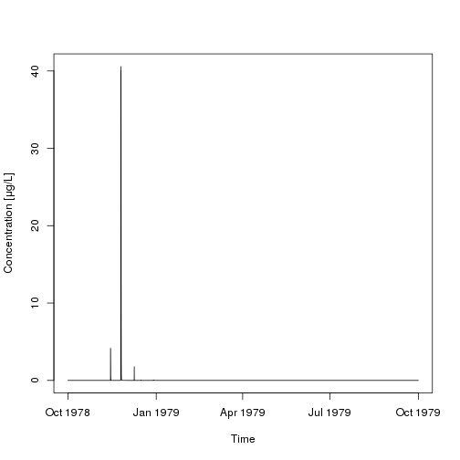

# pfm

The R package **pfm** provides some utilities for dealing with FOCUS pesticide fate modelling tools,
(currently only TOXSWA cwa files), made available under the GNU public license.
This means:

    This program is free software: you can redistribute it and/or modify it under
    the terms of the GNU General Public License as published by the Free Software
    Foundation, either version 3 of the License, or (at your option) any later
    version.

    This program is distributed in the hope that it will be useful, but WITHOUT
    ANY WARRANTY; without even the implied warranty of MERCHANTABILITY or FITNESS
    FOR A PARTICULAR PURPOSE.  See the GNU General Public License for more
    details.

    You should have received a copy of the GNU General Public License along with
    this program. If not, see <http://www.gnu.org/licenses/>

## Installation

You can install the package from [github](http://github.com/jranke/pfm), e.g.
using the `devtools` package.  Using `quick = TRUE` skips docs,
multiple-architecture builds, demos, and vignettes, to make installation as
fast and painless as possible.


```r
library(devtools)
install_github("jranke/pfm", subdir = "pkg", quick = TRUE)
```

## Use

### Analyse TOXSWA output

Read in and analyse a cwa file:


```r
library(pfm)
example_cwa <- read.TOXSWA_cwa("00003s_pa.cwa")
plot(example_cwa)
```

 

```r
example_cwa$get_events(c(20, 100))
example_cwa$moving_windows(c(7, 21))
print(example_cwa)
```

```
## <TOXSWA_cwa> data from file 00003s_pa.cwa segment 20 
##                datetime     t t_firstjan t_rel_to_max cwa_mug_per_L
## 20  1978-10-01 00:00:00 0.000   273.0000      -55.333             0
## 40  1978-10-01 01:00:00 0.042   273.0417      -55.291             0
## 60  1978-10-01 02:00:00 0.083   273.0833      -55.250             0
## 80  1978-10-01 03:00:00 0.125   273.1250      -55.208             0
## 100 1978-10-01 04:00:00 0.167   273.1667      -55.166             0
## 120 1978-10-01 05:00:00 0.208   273.2083      -55.125             0
##     cwa_tot_mug_per_L
## 20                  0
## 40                  0
## 60                  0
## 80                  0
## 100                 0
## 120                 0
## Moving window analysis
##    window  max_TWAC max_AUC_h max_AUC_d
## 1  7 days 2.3926551  401.9660  16.74859
## 2 21 days 0.8369248  421.8101  17.57542
## Event statistics for threshold 20 
##   t_start  cwa_max duration pre_interval    AUC_h   AUC_d
## 1  55.083 40.58401    0.417       55.083 365.7912 15.2413
## Event statistics for threshold 100 
## No events found
```

### Calculate PEC soil

Simple PEC soil calculation for an application rate of 100 g/ha and
25% interception, assuming complete mixing into 5 cm and a soil bulk
density of 1.5 kg/L, output in mg/kg:


```r
PEC_soil(100, int = 0.25)
```

```
## [1] 0.1
```
